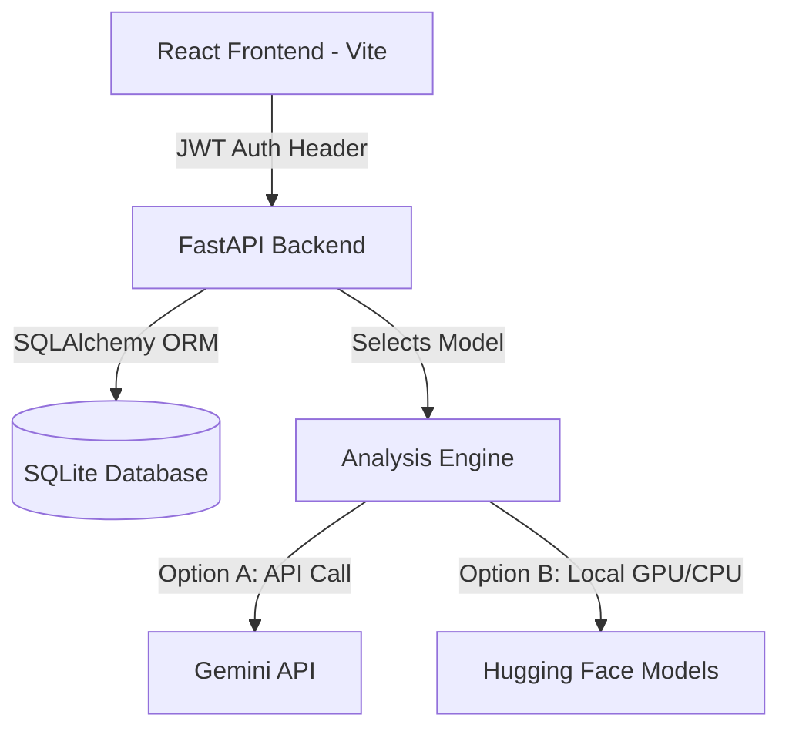

# Implementation Plan: End-to-End News Bias & Debiasing SaaS Project

This plan outlines the roadmap for upgrading the prototype Gradio script into a production-grade, end-to-end web application with a modern React frontend, a FastAPI backend, SQLite database integration, JWT user authentication (Sign Up / Log In), history saving, and local Git repository setup for seamless deployment to GitHub.

## User Review Required

> [!IMPORTANT]
> **AI Analysis Backend Choice**
> Running large Hugging Face BART models (~3.2 GB total weights) on a local CPU takes **10–20+ seconds per article**. For an industry-level SaaS app, we highly recommend integrating the **Gemini API** (`gemini-1.5-flash`), which returns results in **1–2 seconds**, provides superior summarization quality, and has no local hardware resource footprint.
> 
> We will build a flexible configuration that supports:
> - **Gemini API Mode (Recommended)**: Requires a Gemini API Key.
> - **Local BART Mode (Fallback)**: Loads and runs `bart-large-cnn` and `bart-large-mnli` locally.

> [!NOTE]
> **Sleek Glassmorphic Design System**
> The interface will be styled using custom Vanilla CSS (dark mode by default, glassmorphic card overlays, clean gradients, Outfit/Inter typography, and smooth micro-animations). Interactive charts (e.g. bias comparisons) will be rendered dynamically on the client side using Chart.js or Recharts.

---

## Open Questions

> [!WARNING]
> Please review and approve the following design choices before proceeding:
> 1. **Core Directory**: We propose housing this project in a new folder at `c:\projects\news-bias-digest` (independent from the single-file scraping folder). Do you approve?
> 2. **AI Provider**: Would you like to use the Gemini API (via an API key) as the primary analyzer, or do you want to run the local Hugging Face models?
> 3. **Database**: SQLite is proposed for local development. We will use SQLAlchemy ORM, which makes migrating to PostgreSQL, MySQL, or GCP Cloud SQL simple. Is SQLite acceptable for this development stage?

---

## Proposed Architecture & Components

### 1. Backend Layer (Python / FastAPI)
- **FastAPI Framework**: For fast, typed API routing and automatic Swagger docs.
- **Authentication**: JWT-based session tokens with `passlib` (bcrypt) password hashing.
- **ORM & Database**: SQLAlchemy with SQLite to manage User, Article, and Analysis tables.
- **Web Scraper**: Integrated `newspaper3k` and `lxml_html_clean` to extract text from URL submissions.
- **Analysis Pipeline**: Modular model wrapper that calls either Gemini API or local Hugging Face pipelines depending on the configuration.

### 2. Frontend Layer (React / Vite)
- **Vite Setup**: Fast bundling and HMR.
- **Routing**: Client-side React Router for smooth navigation.
- **Pages**:
  - **Landing Page**: Explains key features with modern animations and calls to action.
  - **Auth Page**: Beautiful login/signup cards with error checking.
  - **Dashboard**: Article input (text/URL), live bias analysis chart, side-by-side comparison of original vs. debiased text.
  - **Search & Analysis History**: Every article search and bias analysis is automatically saved to the database. Users can view their full personal history of searches, see previous bias charts, or delete past entries.
- **Charts**: Recharts or Chart.js for beautiful, responsive visualization of ideological bias (Left, Center, Right).

### 3. Git & GitHub Setup
- Initialize Git repository locally: `git init`.
- Create `.gitignore` to prevent committing virtual environments (`.venv`), temporary logs, node modules, database files (`*.db`), or secret environment configurations (`.env`).
- Generate `README.md` with complete instructions on how to run locally and push to the user's remote GitHub repository.

### 4. Deployment & Dockerization Setup
- **Single-Container Deployment**: To maximize simplicity and reduce deployment costs, the FastAPI backend will be configured to serve the React frontend compiled static files.
- **Multi-Stage Dockerfile**: A `Dockerfile` in the project root that builds the React application, builds the Python backend, and outputs a single container serving both the UI and the API.
- **Docker Compose**: A `docker-compose.yml` for quick, one-command local startup of the complete stack.
- **Environment Management**: Clean fallback for local `.env` and Docker environment variables (supporting Gemini API keys, JWT secret keys, and database file paths).

---

## Proposed Changes

We will build the project from scratch in a new, organized project directory:

### [NEW] [Project Root](file:///c:/projects/news-bias-digest)
#### [NEW] [Dockerfile](file:///c:/projects/news-bias-digest/Dockerfile) — Multi-stage docker file for unified deployment.
#### [NEW] [docker-compose.yml](file:///c:/projects/news-bias-digest/docker-compose.yml) — Local development docker compose script.
#### [NEW] [backend/app/main.py](file:///c:/projects/news-bias-digest/backend/app/main.py) — API routes and app configurations.
#### [NEW] [backend/app/models.py](file:///c:/projects/news-bias-digest/backend/app/models.py) — DB models (User, Article, Analysis).
#### [NEW] [backend/app/auth.py](file:///c:/projects/news-bias-digest/backend/app/auth.py) — Password hashing, JWT token creation/verification.
#### [NEW] [backend/app/ml/analyzer.py](file:///c:/projects/news-bias-digest/backend/app/ml/analyzer.py) — AI logic (Gemini API & local BART).
#### [NEW] [frontend/src/App.jsx](file:///c:/projects/news-bias-digest/frontend/src/App.jsx) — Core React router and application layout.
#### [NEW] [frontend/src/index.css](file:///c:/projects/news-bias-digest/frontend/src/index.css) — Custom dark-themed design system.
#### [NEW] [run.py](file:///c:/projects/news-bias-digest/run.py) — Runner script to boot both frontend and backend concurrently.

---

## Verification Plan

### Automated Tests
- Python backend unit tests: `pytest` to test authentication flows and analysis logic mockups.
- API validation: Verify login/register endpoints and article submission endpoint.

### Manual Verification
- **Auth Flow**: Register a new user, log in, verify that the JWT token is stored and protects endpoints.
- **Analysis Run**: Submit a biased news article URL, verify the chart updates and the debiased text renders.
- **History Save**: Check if saved analyses persist after logging out and logging back in.
- **Gradio Migration**: Confirm all features from the original `app1.py` prototype are successfully ported to the React dashboard.
